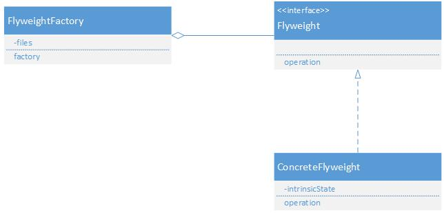
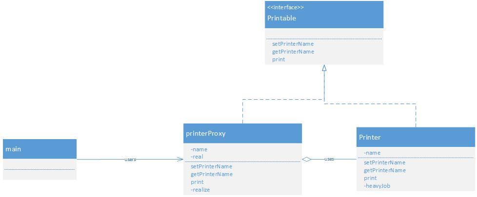

#避免浪费

Flyweight 享元模式[共享对象避免浪费]

抽象享元(Flyweight)角色 ：给出一个抽象接口，以规定出所有具体享元角色需要实现的方法。

具体享元(ConcreteFlyweight)角色：实现抽象享元角色所规定出的接口。如果有内蕴状态的话，必须负责为内蕴状态提供存储空间。

享元工厂(FlyweightFactory)角色 ：本角色负责创建和管理享元角色。本角色必须保证享元对象可以被系统适当地共享。当一个客户端对象调用一个享元对象的时候，享元工厂角色会检查系统中是否已经有一个符合要求的享元对象。如果已经有了，享元工厂角色就应当提供这个已有的享元对象；如果系统中没有一个适当的享元对象的话，享元工厂角色就应当创建一个合适的享元对象。

##proxy 代理模式

抽象对象角色：声明了目标对象和代理对象的共同接口，这样一来在任何可以使用目标对象的地方都可以使用代理对象。

目标对象角色：定义了代理对象所代表的目标对象。

代理对象角色：代理对象内部含有目标对象的引用，从而可以在任何时候操作目标对象；代理对象提供一个与目标对象相同的接口，以便可以在任何时候替代目标对象。代理对象通常在客户端调用传递给目标对象之前或之后，执行某个操作，而不是单纯地将调用传递给目标对象。

