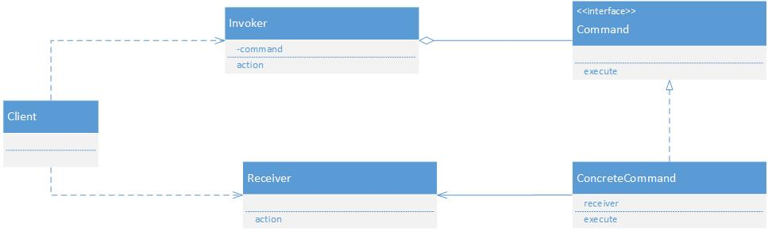
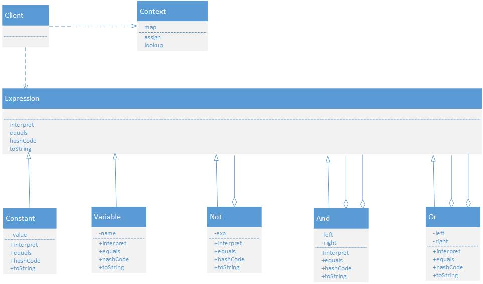

#用类来表现

##Command 命令模式

客户端(Client)角色：创建一个具体命令(ConcreteCommand)对象并确定其接收者。

命令(Command)角色：声明了一个给所有具体命令类的抽象接口。

具体命令(ConcreteCommand)角色：定义一个接收者和行为之间的弱耦合；实现execute()方法，负责调用接收者的相应操作。execute()方法通常叫做执行方法。

请求者(Invoker)角色：负责调用命令对象执行请求，相关的方法叫做行动方法。

接收者(Receiver)角色：负责具体实施和执行一个请求。任何一个类都可以成为接收者，实施和执行请求的方法叫做行动方法。

##interpreter 解释器模式

（1）抽象表达式(Expression)角色：声明一个所有的具体表达式角色都需要实现的抽象接口。这个接口主要是一个interpret()方法，称做解释操作。

（2）终结符表达式(Terminal Expression)角色：实现了抽象表达式角色所要求的接口，主要是一个interpret()方法；文法中的每一个终结符都有一个具体终结表达式与之相对应。比如有一个简单的公式R=R1+R2，在里面R1和R2就是终结符，对应的解析R1和R2的解释器就是终结符表达式。

（3）非终结符表达式(Nonterminal Expression)角色：文法中的每一条规则都需要一个具体的非终结符表达式，非终结符表达式一般是文法中的运算符或者其他关键字，比如公式R=R1+R2中，“+"就是非终结符，解析“+”的解释器就是一个非终结符表达式。

（4）环境(Context)角色：这个角色的任务一般是用来存放文法中各个终结符所对应的具体值，比如R=R1+R2，我们给R1赋值100，给R2赋值200。这些信息需要存放到环境角色中，很多情况下我们使用Map来充当环境角色就足够了。

