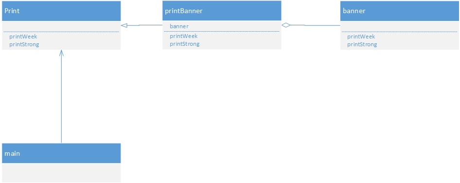

#适应设计模式
##iterator【模式迭代器模式】

aggregate:表示集合的接口

iterator:遍历集合的接口

book:表示书的类

bookShelf:表示书架的类

bookShelfIterator:遍历书架的类

##adapter【适配器模式】

target(对象):目前需要的被适配的东西

client(请求者):使用者,用户

adaptee(被适配):被适配成的东西

adapter(适配):适配转换方式

