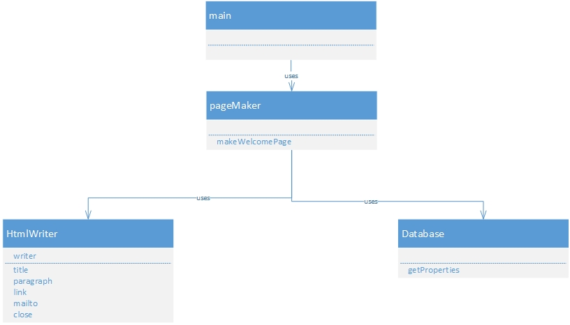
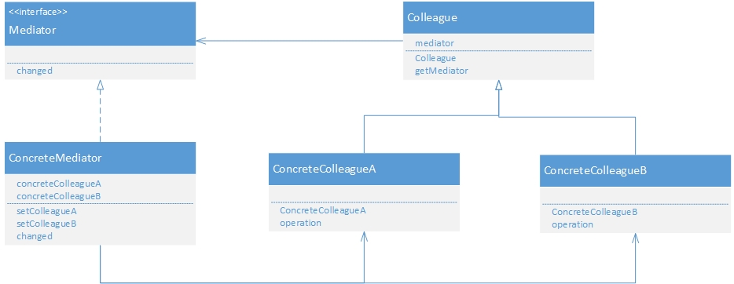

#简单化

##Facade 门面模式[简单窗口]

Facade(窗口):构成系统中其他角色的简单窗口,Facade角色向系统外提供高层接口.屏蔽系统内复杂结构.pageMaker扮演.

构成系统的许多其他角色:他们完成自己工作,并不知道Facade角色调用其他角色进行工作,但其他角色不会调用Facade角色,由Database,和HtmlWriter扮演.

Client(请求者):负责调用Facade角色,无需关注内部复杂结构

##mediator 调停者模式[只有一个仲裁者]

抽象调停者(Mediator)角色：定义出同事对象到调停者对象的接口,其中主要方法是一个（或多个）事件方法.

具体调停者(ConcreteMediator)角色：实现了抽象调停者所声明的事件方法.具体调停者知晓所有的具体同事类,并负责具体的协调各同事对象的交互关系.

抽象同事类(Colleague)角色：定义出调停者到同事对象的接口.同事对象只知道调停者而不知道其余的同事对象.

具体同事类(ConcreteColleague)角色：所有的具体同事类均从抽象同事类继承而来.实现自己的业务,在需要与其他同事通信的时候,就与持有的调停者通信,调停者会负责与其他的同事交互.

