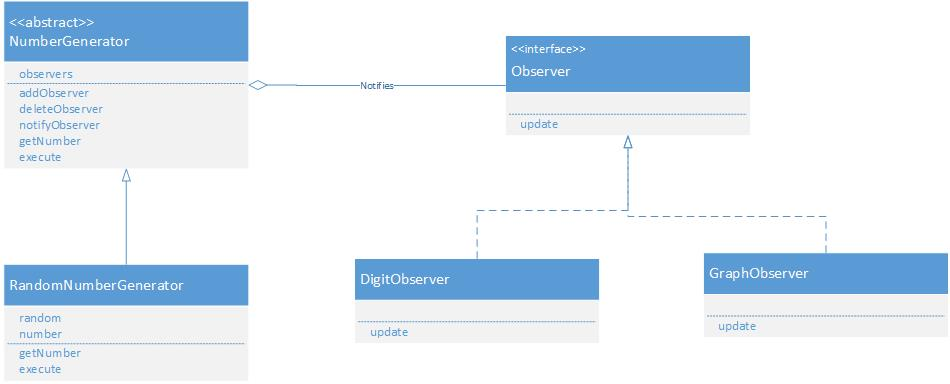
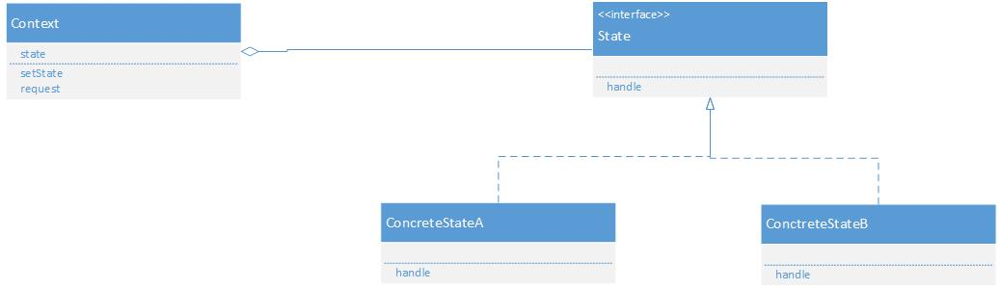

#管理状态

##observer 观察者模式[发送状态变化通知]

Subject(被观察者):表示被观察者,定义了注册和删除观察者方法,还声明了获取现在的状态方法,由NumberGenerator类扮演此角色.

ConcreteSubject(具体被观察者):表示具体的被观察者,当自身状态发生变化后,会通知所有已注册的Observer角色.由RandomNumberGenerator类扮演.

Observer(观察者):负责接受来自Subject角色的变化通知,由Observer扮演.

ConcreteObserver(具体观察者):表示具体的Observer当他的update方法被调用后会获取到被观察者的最新状态,由DigitObserver和GraphObserver扮演.

##memento 备忘录模式[保存对象的状态]

备忘录(Memento)角色

    备忘录角色又如下责任：

    （1）将发起人（Originator）对象的内战状态存储起来。备忘录可以根据发起人对象的判断来决定存储多少发起人（Originator）对象的内部状态。

    （2）备忘录可以保护其内容不被发起人（Originator）对象之外的任何对象所读取。

    备忘录有两个等效的接口：

        ●窄接口：负责人（Caretaker）对象（和其他除发起人对象之外的任何对象）看到的是备忘录的窄接口(narrow interface)，这个窄接口只允许它把备忘录对象传给其他的对象。

        ●宽接口：与负责人对象看到的窄接口相反的是，发起人对象可以看到一个宽接口(wide interface)，这个宽接口允许它读取所有的数据，以便根据这些数据恢复这个发起人对象的内部状态。

发起人（Originator）角色

    发起人角色有如下责任：

        （1）创建一个含有当前的内部状态的备忘录对象。

        （2）使用备忘录对象存储其内部状态。

负责人（Caretaker）角色

    负责人角色有如下责任：

        （1）负责保存备忘录对象。

        （2）不检查备忘录对象的内容。
        

##状态模式

●环境(Context)角色，也成上下文：定义客户端所感兴趣的接口，并且保留一个具体状态类的实例。这个具体状态类的实例给出此环境对象的现有状态。

●抽象状态(State)角色：定义一个接口，用以封装环境（Context）对象的一个特定的状态所对应的行为。

●具体状态(ConcreteState)角色：每一个具体状态类都实现了环境（Context）的一个状态所对应的行为。

