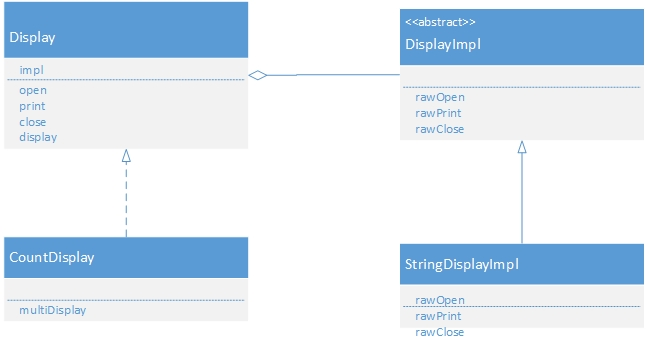
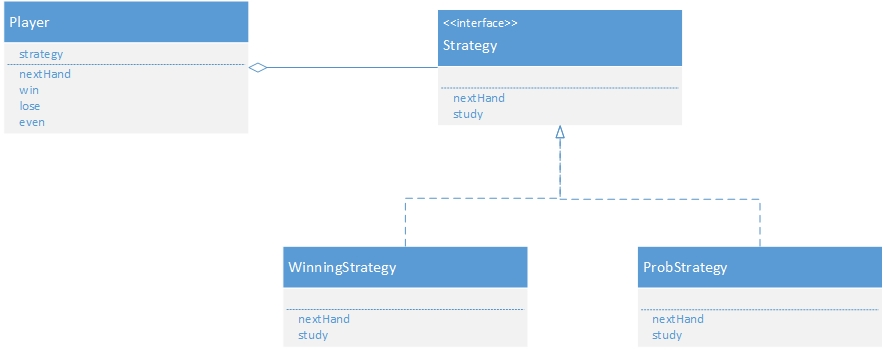

#分开考虑
将类功能层次接口和实现功能层次接口分离

##bridge 桥梁模式[分离抽象和实现部分]

Abstraction(抽象化):类功能层次结构最上层,该角色中保存了Implementor角色实例.Display类扮演此角色.

RefinedAbstraction(改善后的抽象化):在Abstraction角色基础上增加了新功能的角色,由CountDisplay类扮演此角色.

Implementor(实现者):类的实现层次结构的最上层,定义了用于实现Abstraction角色的接口,DisplayImpl类扮演此角色.

ConcreteImplementor(具体实现者):实现在Implementor角色中定义的接口,由StringDisplayImpl类扮演.

##strategy 策略模式[整体替换算法实现]

Strategy(策略):决定实现策略所必须的接口,由Strategy接口扮演.

ConcreteStrategy(具体的策略):实现strategy接口,由WinningStrategy类和ProbStrategy类扮演.

Context(上下文):调用策略模式

