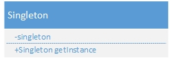
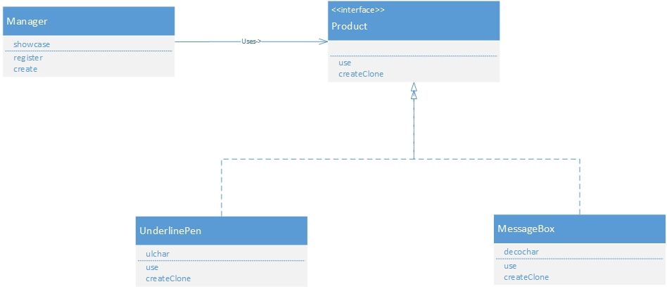
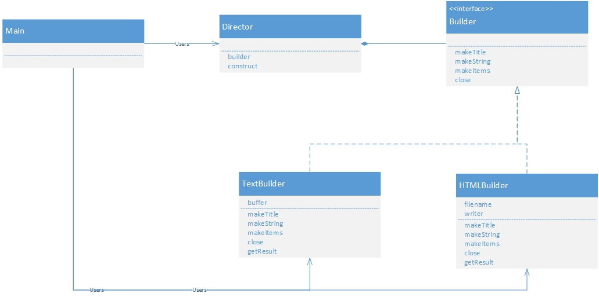
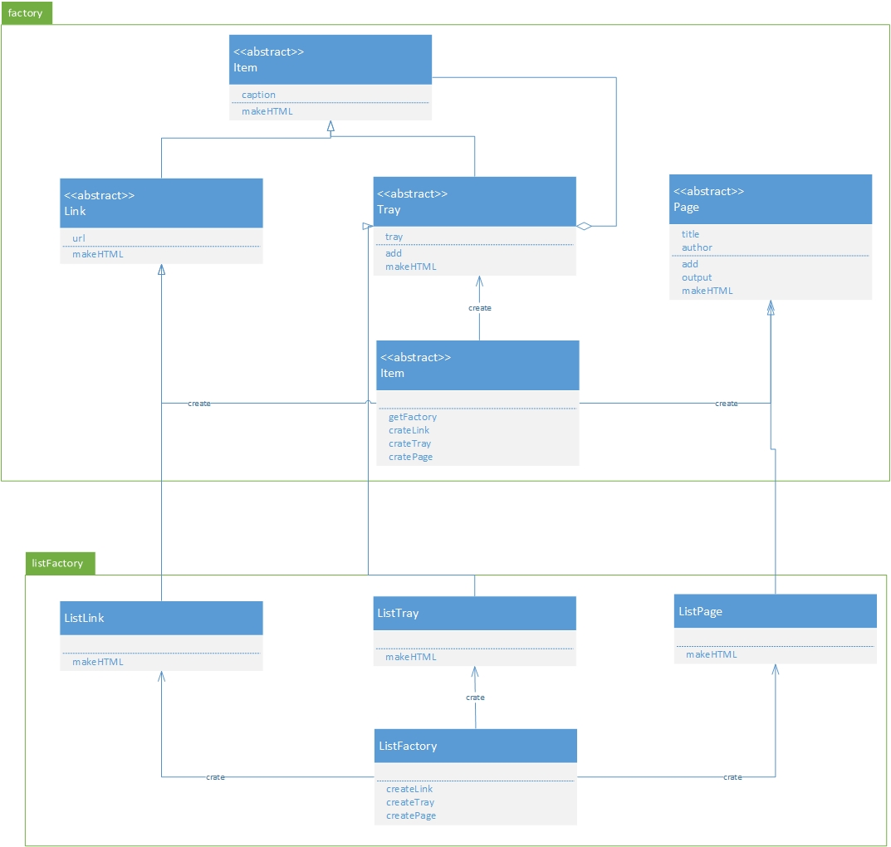

#生成实例
创建实例相关

##singleton 单例模式

Singleton:返回唯一实例的static方法,该方法总返回唯一实例

##prototype 原型模式
通过复制方式生成实例

Prototype(原型):定义用于复制现有实例来生成新的实例的方法.

ConcretePrototype(具体的原型):实现复制现有实例并生成新实例的方法.

Client(使用者):使用复制实例的方法生成新的实例

##builder 建造者模式
组装复杂的实例

Builder(建造者):定义生成实例接口,此角色中准备了用户生成实例的方法.Builder即可扮演此角色

ConcreteBuilder(具体建造者):具体实现生成实例的方法,TextBuilder和HTMLBuilder扮演此角色

Director(监工):使用Builder角色的接口来生成实例.

Client(使用者):使用Director来创建实例

##abstractfactory 抽象工厂模式
将抽象零件组装成抽象产品

AbstractProduct(抽象产品):定义抽象工厂生成的抽象产品,Link,Tray,Page抽象类扮演该角色

AbstractFactory(抽象工长):定义用于生成抽象产品的接口(API),Factory抽象类扮演

Client(委托者):会调用AbstractFactory角色和AbstractProduct进行工作,对于具体的零件产品和工厂一无所知.

ConcreteProduct(具体产品):实现AbstractProduct接口,由listfactory和tablefactory中的listLink,listTray,listPage和tableLink,tableTray,tablePage类扮演此角色

concreteFactory(具体工厂):实现AbstractFactory接口,由listfactory和tablefactory中的listFactory和tableFactory类扮演

