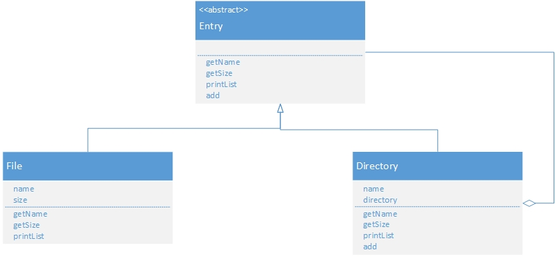
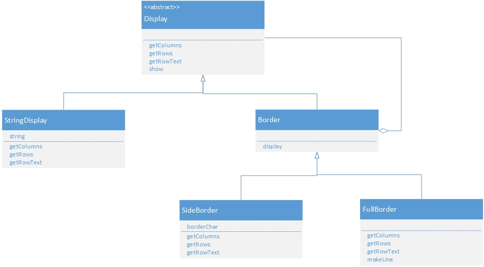

#一致性

##composite 组合模式[容器与内容一致]

Leaf(树叶):该角色不能放入其他对象,File扮演此类角色.

Composite(复合物):可以在其中放入Leaf角色和Composite角色,由Directory类扮演.

Component(容器):使Leaf角色和Composite角色具有一致性角色.Component角色是Leaf和Composite角色的父类,Entry类扮演.

##decorator 装饰模式[装饰边框与被装饰者一致性]

Component(被装饰者):定义被装饰者接口,由Display扮演

ConcreteComponent(具体被装饰者):实现了component角色所定义的接口,由StringDisplay类扮演.

Decorator(装饰物):该角色与Component有相同接口,在他内部保存了-Component角色,Border类扮演此角色.

ConcreteDecorator(具体的装饰物):该角色是具体的decorator角色,由sideBorder类和FullBorder
类扮演此角色.

