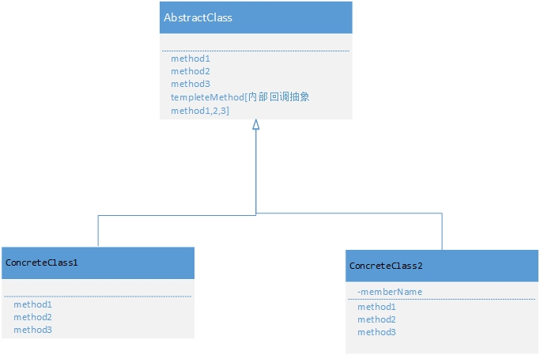
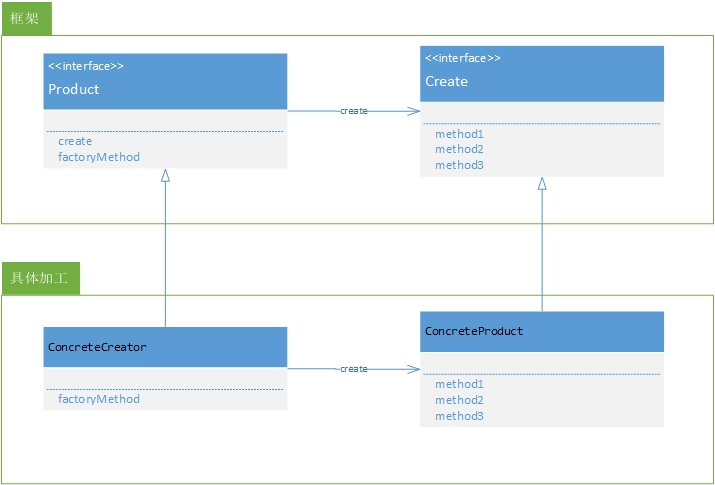

#交给子类
将具体处理交给子

##templatemethod 模版方法模式

AbstractClass[抽象类]:声明模版中的抽象方法

ConcreteClass[具体类]:具体实现抽象类中定义的抽象方法

##factorymethod 工厂模式 

注:工厂模式是模版模式的典型应用

Product[产品]:产品的抽象

Creator[创建者]:工厂的抽象

---

ConcreteProduct[具体产品]:根据工厂规则产生的具体产品

ConcreteCreator[具体的创建者]:具体的工厂生产规则

