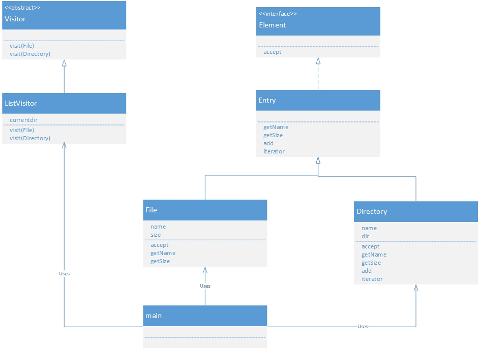
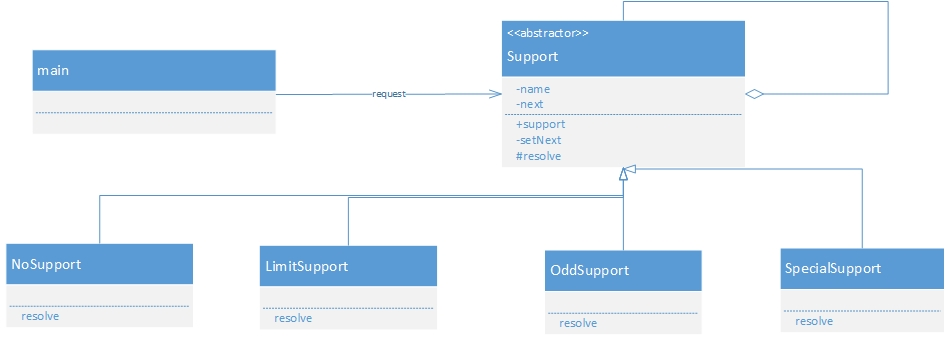

#访问数据结构

##visitor 访问者模式

Visitor(访问者):负责对数据结构中每个具体元素(ConcreteElement角色)声明一个用于访问XXX的visit(XXX)方法,负责实现该方法的是ConcreteVisitor角色.由Visitor类扮演此角色.

ConcreteVisitor(具体的访问者):负责实现Visitor所定义的接口,实现处理ConcreteElement角色,由ListVisitor扮演.

Element(元素):表示visitor的访问对象,声明了接受访问者的accept方法.accept方法接收到的参数是visitor角色.Element扮演.

ConcreteElement(具体元素):实现Element角色定义的接口,由File和Directory类扮演此角色.

ObjectStructure(对象结构):负责处理Element角色的集合,ConcreteVisitor角色为每个Element角色都准备了处理方法,由Directory类扮演此角色.

##chain of responsibility 职责链模式

handler(处理者):定义了处理请求的接口,handler知道下一个处理者是谁,如果自己无法处理会将请求转给下一个处理者,support扮演此角色.

concreteHandler(具体处理者):具体处理请求的handler,由NoSupport,LimitSupport,OddSupport,SpecialSupport扮演.

Client(请求者):第一个向ConcreteHnadler发送请求的角色.

